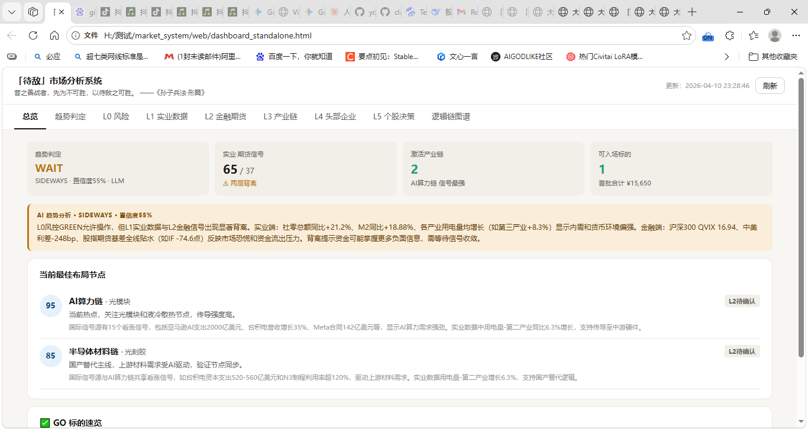
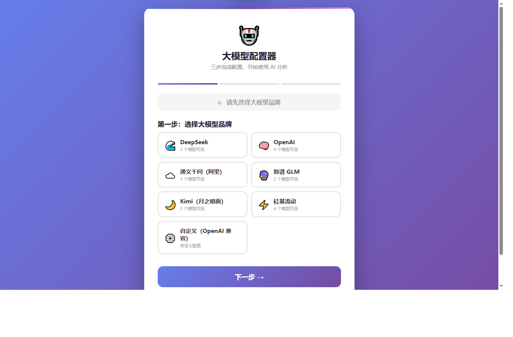

# 「待敌」市场分析系统

> 昔之善战者，先为不可胜，以待敌之可胜。 ——《孙子兵法·形篇》

> **免责声明**：本工具仅供学习研究使用，不构成任何投资建议。投资有风险，决策需自负。

从宏观风险到个股仓位，六层递进式筛选，结合实时数据采集 + LLM 智能分析，自动生成投资决策报告。先立于不败之地，再等待市场给出可胜之机。

<table>
<tr>
<td width="50%"></td>
<td width="50%"></td>
</tr>
<tr>
<td align="center"><b>Web 可视化仪表盘</b> — 六层数据一屏呈现</td>
<td align="center"><b>大模型配置器</b> — 三步完成，支持 7 大品牌</td>
</tr>
</table>

---

## 快速开始

> **不想碰命令行？直接双击即可：**
> - **Windows**：双击 `start.bat`
> - **macOS**：双击 `start.command`（首次需右键→打开→确认）
>
> 脚本会自动安装依赖 → 运行分析 → 打开浏览器查看结果。

### 方式一：一键启动（推荐新手）

| 平台 | 操作 |
|------|------|
| **Windows** | 双击 `start.bat` |
| **macOS** | 双击 `start.command`（首次需要：右键→打开） |
| **Linux** | 终端运行 `chmod +x start.command && ./start.command` |

脚本自动完成以下步骤：
1. 检测 Python 环境（未安装则提示下载链接）
2. 安装/更新依赖包
3. 运行六层分析，生成数据
4. 启动 Web 服务器，自动打开浏览器

### 方式二：手动安装

#### 1. 安装依赖

**Windows / macOS / Linux 通用：**

```bash
pip install -r requirements.txt
```

> 需要 Python 3.9+。如果系统提示 `pip` 不是最新版本，可先运行 `pip install --upgrade pip`。
> macOS 用户如提示权限错误，请使用 `pip3 install -r requirements.txt`。

### 2. 配置大模型（产业链分析 + 趋势判断需要）

**方式一：图形化配置器（推荐，操作最简单）**

```bash
python setup_llm.py
```

自动打开浏览器，进入可视化配置页面。三步完成：

1. **选择品牌** — DeepSeek / OpenAI / 通义千问 / 智谱GLM / Kimi / 硅基流动 / 自定义
2. **粘贴 API Key** — 选择模型
3. **测试连接 → 保存**

配置保存在 `llm_config.json`，启动分析自动读取。

**方式二：手动创建 `.env` 文件**

在项目根目录创建 `.env` 文件：

```
DEEPSEEK_API_KEY=sk-xxxxxxxxxxxxxxxxxxxxxxxx
```

> 不配置 API Key 也能运行，但 L3 产业链匹配和趋势判断会退化为规则引擎（精度降低）。

### 3. 运行分析

**方式一：终端交互式报告（Rich 美化输出）**

```bash
python main.py
```

```
python main.py --capital 500000          # 指定总资金50万
python main.py --env BULL                # 强制牛市环境
python main.py --codes 300308 300394     # 只分析指定股票
python main.py --env BEAR --capital 200000
```

| 参数 | 说明 | 默认值 |
|------|------|--------|
| `--capital` | 总资金（元） | 1000000 |
| `--env` | 市场环境：BULL / SIDEWAYS / BEAR | 自动判断 |
| `--codes` | 指定股票代码（空格分隔） | 全库 |

**方式二：生成 JSON 数据文件（供前端面板读取）**

```bash
python export_json.py
```

生成 `web/dashboard.json`，包含全部六层数据 + 国际信号 + 趋势判定。双击 `web/index.html` 即可查看 Web 面板。

**方式三：定时自动执行（进阶）**

- **Windows**：双击 `run_daily.bat`，或配合「任务计划程序」每天定时执行。
- **macOS / Linux**：

```bash
chmod +x run_daily.sh
./run_daily.sh

# 或添加到 crontab（每周一 9:00 自动执行）：
# crontab -e → 添加：0 9 * * 1 cd /你的路径/market_system && ./run_daily.sh >> logs/weekly.log 2>&1
```

### 4. 检查各层数据是否正常

```bash
python test_all.py
```

逐层测试，确认所有 API 接口可用，输出每层的关键数据摘要。

---

## 系统架构

```
┌─────────────────────────────────────────────────────┐
│                   Layer 0 风险管理                    │
│  上证指数 / VIX / 汇率 / 北向资金                     │
│  → 输出：GREEN / YELLOW / RED + 最大仓位              │
├─────────────────────────────────────────────────────┤
│                   Layer 1 实业数据                    │
│  农产品价格 / 期货铜螺纹铝 / M1M2剪刀差 / PMI         │
│  / 用电量 / 建筑业景气 / 房地产投资 / BDI             │
│  → 输出：综合评分 + 异动指标                          │
├─────────────────────────────────────────────────────┤
│                 Layer 2 金融期货                      │
│  美元指数 / 美中10Y利差 / QVIX / 股指期货基差          │
│  / 黄金现货 / SPDR持仓 / ISM PMI                     │
│  → 输出：资金方向 + 背离信号                          │
├─────────────────────────────────────────────────────┤
│               Layer 3 产业链传导图谱                  │
│  LLM 动态匹配产业链 + 国际信号源新闻数据              │
│  （AI算力 / 半导体 / 新能源车 / 航空航天 / 有色金属）  │
│  → 输出：激活产业链 + 最佳操作节点                    │
├─────────────────────────────────────────────────────┤
│                 Layer 4 头部企业                      │
│  自动化财务评分：PE/PB/ROE/毛利率/营收增速            │
│  四道过滤器：收入结构 + 客户 + 毛利率 + 资本开支       │
│  → 输出：REAL / WATCH / FAKE 筛选结果                │
├─────────────────────────────────────────────────────┤
│                 Layer 5 个股确认                      │
│  量价信号（突破/缩量/蓄势）+ 支撑止损位              │
│  → 输出：GO / WAIT / NO + 建议仓位 + 首批金额        │
└─────────────────────────────────────────────────────┘
```

---

## 六层详解

### Layer 0 — 风险管理（否决层）

| 指标 | 数据源 | 用途 |
|------|--------|------|
| 上证指数近5日涨跌 | akshare | 趋势方向 |
| 北向资金净流入 | 东方财富 | 外资态度 |
| VIX 恐慌指数 | akshare | 全球恐慌度 |
| 人民币汇率 | akshare | 资本流动 |

输出：**GREEN**（正常）/ **YELLOW**（减半仓位）/ **RED**（空仓）
任一红灯触发 → 强制空仓。

### Layer 1 — 实业数据（温度计）

| 板块 | 关键指标 | 数据源 |
|------|---------|--------|
| 食品 | 农产品批发价200指数、生猪/玉米/大豆现货 | 农业农村部、搜猪网 |
| 大宗 | 铜/螺纹钢/铝/黄金期货、上海金现货 | 上期所、上海金交所 |
| 宏观 | M1M2剪刀差、社融增速、PMI及子项 | 央行、统计局 |
| 基建 | 建筑业景气、房地产开发投资 | 物流与采购联合会、统计局 |
| 运价 | BDI/BCI、国内汽油调价 | 波罗的海交易所、发改委 |
| 用电 | 全社会用电量（含分行业） | 国家能源局 |

每个指标计算 Z-Score 偏离度，超过 1.5σ 标记异动。

### Layer 2 — 金融期货（资金方向）

| 指标 | 数据源 | A股传导含义 |
|------|--------|------------|
| 美元指数 DXY | 东方财富 | 强美元→外资流出 |
| 美/中10Y国债利差 | 东方财富+中国债券网 | 利差收窄→利好A股 |
| 沪深300 QVIX | 东方财富期权 | 低波动→做多友好 |
| IF/IC/IM 基差 | 上期所 | 升水→多头信心 |
| ISM PMI | akshare | 外需强弱 |

### Layer 3 — 产业链传导（LLM 核心）

内置产业链知识库，LLM 结合 L1+L2 实时数据 + **国际信号源新闻**动态匹配：

- **国际信号采集**（`international_signals.py`）：32个关键词从东方财富抓取近14天新闻，费城半导体指数实时行情，LLM 提取结构化信号
- 覆盖产业链：AI算力链、半导体链、新能源车链、出口制造链、航空航天材料链、铜/铝/有色金属链、港口物流链
- 输出：激活的产业链 + 当前传导到哪个节点 + 操作窗口建议

### Layer 4 — 头部企业（财务过滤）

自动从东方财富/同花顺抓取实时财务数据，评分维度：

| 维度（各25分） | 评分项 |
|---------------|--------|
| 收入结构 | 营收同比增速 |
| 客户名单 | 客户质量 |
| 毛利率趋势 | 毛利率/净利率 |
| 资本开支 | ROE + 负债率 |

综合评分 → **REAL**（真成长）/ **WATCH**（观察）/ **FAKE**（伪成长）

### Layer 5 — 个股确认（时机+仓位）

- **量价信号**：突破（放量新高）、缩量（洗盘蓄势）、蓄势（横盘整理）
- **止损位**：近20日低点支撑
- **仓位计算**：环境上限 × 层数加成 × 止损修正
- **分批建仓**：首批40% → 确认40% → 再验证20%

---

## 输出产物

| 文件 | 说明 | 生成方式 |
|------|------|---------|
| 终端报告 | Rich 美化的六层分析报告 | `python main.py` |
| `reports/report_*.txt` | 文本报告存档 | `python main.py` 自动保存 |
| `web/config.html` | 大模型配置页面 | `python setup_llm.py` 打开 |
| `web/dashboard.json` | 结构化 JSON 数据 | `python export_json.py` |
| `web/index.html` | Web 可视化面板 | 双击打开，读取 JSON |
| `logs/` | 运行日志 | 自动生成 |

---

## 定时运行

### Windows（任务计划程序）

1. 打开「任务计划程序」→ 创建基本任务
2. 触发器：每周一 9:00
3. 操作：启动程序 `python`，参数 `export_json.py`，起始于项目目录
4. 或直接双击 `run_daily.bat` 手动执行

### Linux / macOS

```bash
# crontab -e
0 9 * * 1 cd /path/to/market_system && python export_json.py >> logs/weekly.log 2>&1
```

---

## 自定义配置

### 添加/修改分析标的

编辑 `layer45_stocks.py` 中的 `COMPANY_DB` 字典：

```python
"300308": CompanyProfile(
    code="300308", name="中际旭创", chain="AI算力链", node="光模块",
    revenue_score=20, client_score=22, margin_score=18, capex_score=20,
    green_flags=["800G光模块全球份额第一"], red_flags=["客户集中度高"],
    verdict="REAL", note="800G光模块龙头"
),
```

### 调整异动阈值

在 `layer1_industry.py` 的 `_safe()` 函数中修改 Z-Score 阈值：

- `> 2.0` → ALERT_UP（强烈异动）
- `> 1.5` → UP（正向信号）
- `< -1.5` → DOWN（负向信号）
- `< -2.0` → ALERT_DOWN（强烈异动）

### 修改国际信号关键词

编辑 `international_signals.py` 中的 `KEYWORD_GROUPS` 字典，按产业链添加/删除新闻搜索关键词。

### LLM 模型切换

**方式一：图形化配置器**
```bash
python setup_llm.py
```

**方式二：编辑 `llm_config.json`**
```json
{
  "provider": "deepseek",
  "api_key": "sk-xxx",
  "base_url": "https://api.deepseek.com",
  "model": "deepseek-reasoner"
}
```

**方式三：代码级修改**

编辑 `llm_client.py`：

```python
_MODEL = "deepseek-reasoner"   # 深度推理，更精准
# _MODEL = "deepseek-chat"     # 便宜快速，适合日常
```

---

## 文件说明

```
market_system/
├── main.py                    # 主控程序（终端交互式报告）
├── export_json.py             # JSON 导出（供 Web 面板）
├── layer0_risk.py             # L0 风险管理
├── layer1_industry.py         # L1 实业数据采集
├── layer2_futures.py          # L2 金融期货数据
├── layer3_chains.py           # L3 产业链匹配（LLM）
├── layer45_stocks.py          # L4 企业筛选 + L5 个股确认
├── international_signals.py   # 国际信号源采集（新闻+指数）
├── trend_judge.py             # 趋势综合判定（LLM）
├── llm_client.py              # 大模型客户端（多品牌支持）
├── test_all.py                # 逐层测试脚本
├── run_daily.bat              # Windows 一键运行
├── run_daily.sh               # macOS / Linux 一键运行
├── requirements.txt            # Python 依赖清单（pip install -r）
├── setup_llm.py              # 大模型图形化配置器（一键配置）
├── llm_config.json            # 大模型配置（配置器自动生成）
├── .env                       # API Key 配置（旧方式，可选）
├── web/
│   ├── index.html             # Web 面板入口
│   ├── config.html            # 大模型配置页面（setup_llm.py 调用）
│   ├── echarts.min.js          # ECharts 本地副本
│   ├── dashboard.json         # 最新分析数据
│   └── dashboard_standalone.html
├── reports/                   # 文本报告存档
├── logs/                      # 运行日志
└── 构思/                      # 设计文档参考
```

---

## 常见问题

**Q: 运行报错 "ConnectionError" 或连接超时？**
A: 部分数据源（北向资金、美股行情）偶尔不稳定，系统已做容错处理，不影响整体分析。

**Q: 没有 DeepSeek API Key 能用吗？**
A: 能。L3 产业链会退化为规则匹配（基于关键词触发），L5 仓位计算和 L0-L2 数据采集不受影响。

**Q: 分析耗时多久？**
A: 约 2-3 分钟。其中新闻采集 ~25秒、LLM 调用 ~20秒、行情数据 ~30秒，其余为并行 API 调用。

**Q: 数据更新频率？**
A: L0/L2/L5 实时数据每日更新；L1 宏观数据月度更新（自动取最新可用）；L4 财务数据季报更新。
